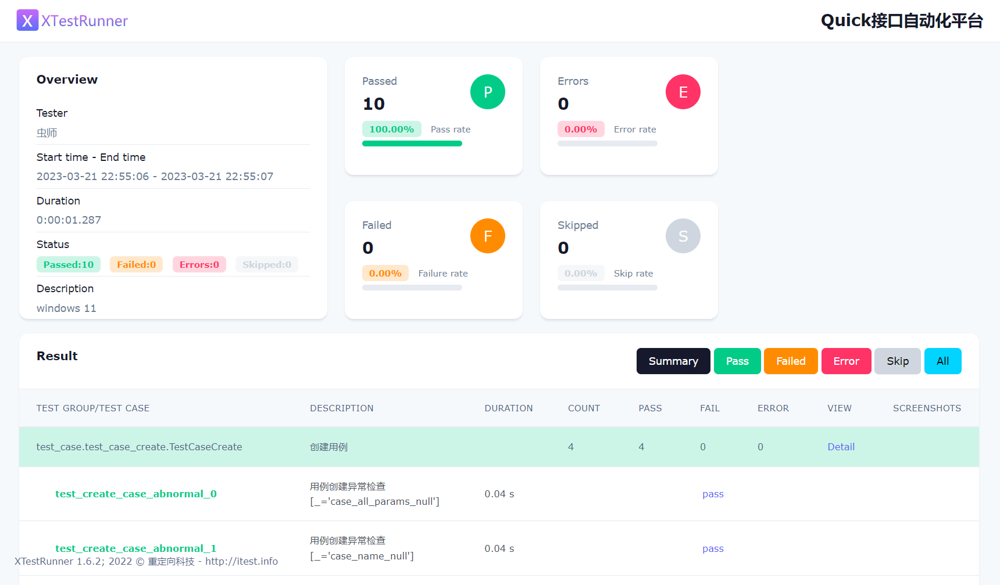

# seldom-api-testing

介绍： 这是一个基于 [Seldom](https://github.com/SeldomQA/seldom) 测试框架实现的接口自动化项目。


### 安装

* 安装 seldom

```shell
pip install seldom==3.6
```

* 运行测试

```shell
> seldom -p test_dir/

...
````

* 测试报告




### 目录结构

接口自动化项目，请参考下面的目录结构进行设计。 

```shell
mypro/
.
D:.
├───common                   # 封装公共模块
│   └───__init__.py
├───reports                  # 测试报告
├───test_data                # 测试数据
│   └───__init__.py
├───test_dir                 # 测试用例目录
│   ├───test_base            # 测试用例子目录
│   │   └───__init__.py
│   ├───test_data_driver
│   │   └───__init__.py
│   ├───test_more
│   │   └───__init__.py
│   └───__init__.py
└───confrun.py              # 运行配置文件
```
