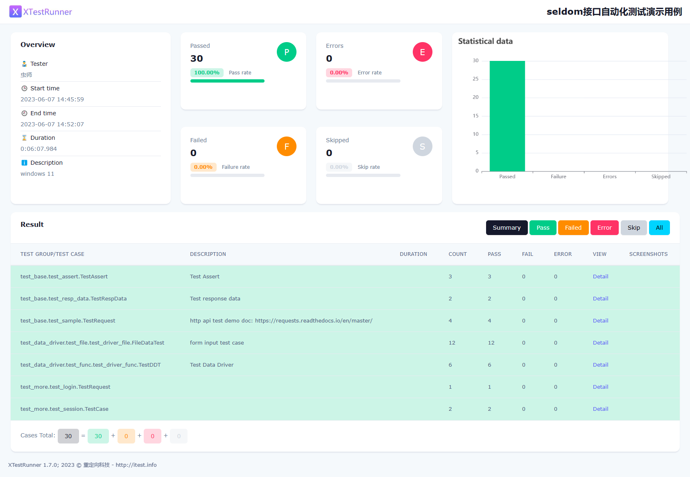

# seldom-api-testing

介绍： 这是一个基于 [Seldom](https://github.com/SeldomQA/seldom) 测试框架实现的接口自动化项目。

### 安装

* 安装依赖库

```shell
pip install seldom==3.11.0
```

### 目录结构

接口自动化项目，请参考下面的目录结构进行设计。 

```shell
mypro/
.
D:.
├───api_object/              # 使用 AOM 设计模式
├───reports/                 # 测试报告
├───test_data/               # 测试数据
├───test_dir                 # 测试用例目录
│   ├───test_base            # 测试用例子目录
│   ├───test_data_driver
│   ├───test_more
│   └───...
├───confrun.py                  # 运行文件
└───run.py              # 运行配置文件
```

## 运行测试

### 方式1. `seldom`命令

* `seldom` 命令执行，通过`confrun.py` 文件运行配置。

```shell
> seldom -p test_dir/

...
````

### 方式2. `main()`方法

* 编写 `run.py` 运行文件。

```python
# run.py
import seldom

if __name__ == '__main__':
    seldom.main(
        path="./test_dir",  # 运行用例目录
        base_url="https://httpbin.org",  # 基础URL地址
        rerun=3,   # 重跑次数
        language="zh-CN"  # 中文报告
    )
````

* 运行测试

```shell
> python run.py
```

* 测试报告



